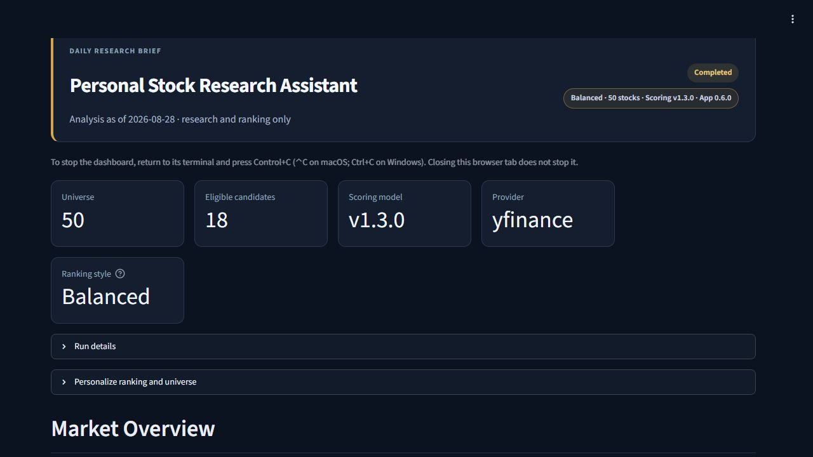
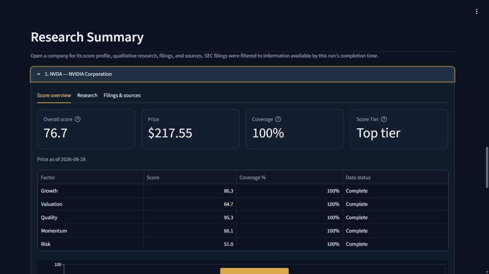

# Stock Research Assistant

[](https://github.com/nlibby17/Stock-Research-Assistant/actions/workflows/ci.yml)
[MIT licensed](LICENSE)

A local, research-only U.S. stock screener and ranking application. It downloads
daily market data, keeps compact historical results in SQLite, calculates an
interpretable score, and presents the result in a Streamlit dashboard. It never
connects to a broker and it never places trades.

Version 1 is deliberately modest: an explicit 50-company, all-sector universe,
end-of-day/previous-close analysis, and a replaceable data-provider interface.
Python performs every deterministic calculation. Optional current-news, filing,
earnings, and qualitative research may be completed by a person or capable AI agent;
there is no OpenAI API integration.



## What it provides

- A reproducible relative ranking across an explicit, user-approved stock universe.
- Transparent growth, valuation, quality, momentum, and risk components with
  separate data-coverage reporting.
- SEC filing and Company Facts ingestion with source dates, local calculations,
  provider diagnostics, and immutable run history.
- A cross-platform guided setup, one-command morning workflow, personal ranking
  styles, custom universes, CSV export, and local dashboard.
- Optional current-source qualitative research that can be completed by a person or
  capable AI agent without coupling the application to one AI vendor.

This is a research and ranking aid—not investment advice, a prediction engine, or
an automated trading system. Scores describe relative standing within the selected
universe and do not represent expected returns.

## Quick start

Python 3.11+ is required. The guided setup uses Python 3.13 on current systems and
Python 3.12 with a tested PyArrow 15.0.2 wheel on macOS 11 for binary-package
compatibility.

### Windows 10 or 11

```powershell
powershell -ExecutionPolicy Bypass -File .\scripts\setup.ps1
```

### macOS

After installing Git and the Python version listed in [SETUP.md](SETUP.md), clone the
project and run:

```bash
git clone https://github.com/nlibby17/Stock-Research-Assistant.git stock-research-assistant
cd stock-research-assistant
bash ./scripts/setup.sh
open -e .env
./.venv/bin/stockrank setup-check
```

In `.env`, replace the `SEC_USER_AGENT` placeholder with a descriptive application
name and real contact email before running `setup-check`. The default Yahoo provider
does not require an API key. For guided Windows and macOS instructions, first-report
commands, personalization, and safe updates, see [SETUP.md](SETUP.md).

For normal daily use, run one platform-specific command from the project folder:

```powershell
# Windows
.\.venv\Scripts\stockrank.exe morning
```

```bash
# macOS
./.venv/bin/stockrank morning
```

The reference list below uses `stockrank` as shorthand for the executable inside
that local `.venv`. While the dashboard is running, keep its terminal open. Stop it
with **Ctrl+C on Windows** or **Control+C (⌃C) on macOS**; closing the browser tab
alone does not stop the local dashboard server. `morning` and `dashboard` open the
dashboard in the default browser automatically. If browser opening is unavailable,
use the local URL printed in the terminal.

```powershell
# One-command morning workflow: build the report, then open the dashboard
stockrank morning

# Network-backed analysis
stockrank run

# Report-only deterministic workflow
stockrank daily-report

# Guided personal profile and universe setup
stockrank configure

# Validate active settings (add --live for provider coverage)
stockrank config-check

# Deterministic synthetic data, clearly labelled (useful for setup/tests only)
stockrank run --demo

# Open the latest dashboard without creating a new report
stockrank dashboard

# Safely update an existing Windows installation (macOS: bash ./scripts/update.sh)
powershell -ExecutionPolicy Bypass -File .\scripts\update.ps1

# SEC ticker/CIK/exchange identity and provider-health check
stockrank sec-health

# Bypass the 24-hour SEC identity cache for an explicit live check
stockrank sec-health --force

# Sync five years of normalized 10-K/10-Q filing metadata
stockrank sec-filings-sync

# Inspect stored filing coverage without making network requests
stockrank sec-filings-status

# Sync and inspect five years of normalized SEC Company Facts/XBRL data
stockrank sec-facts-sync
stockrank sec-facts-status

# Build and inspect immutable SEC-derived financial snapshots (not ranking inputs)
stockrank sec-financials-build
stockrank sec-financials-status

# Record and inspect an immutable SEC/Yahoo shadow comparison (not ranking inputs)
stockrank provider-shadow-run
stockrank provider-shadow-status

# Storage inspection and safe cleanup preview
stockrank storage-status
stockrank storage-clean
```

The latest Markdown report is written to `runtime/reports/latest.md`. Runtime
outputs are intentionally ignored by Git.

## Dashboard and research detail

The dashboard summarizes market context, three-month sector leaders, eligible top
candidates, score composition, source-aware research, SEC filings, and provider/data
quality. It includes a same-model/same-universe comparison with the previous
completed report, an Excel-friendly CSV download of all current rankings, and
read-only guidance for personalizing the installation. Observed rank and score
changes are not presented as causal explanations.

Each candidate opens into a focused Research Summary with separate score, research,
and filing/source views. Deterministic scores and coverage remain distinct from
qualitative interpretation.



*Example from a stored local report. Rankings are relative research outputs, not
investment recommendations.*

## Personal profiles and universes

The tracked default remains a balanced 50-stock universe. `stockrank configure`
creates an optional per-computer profile with a selected ranking style, horizon,
risk tolerance, thresholds, and explicit custom universe. The effective weights are
shown before saving. Generated `config/preferences.local.toml` and
`config/universe.local.csv` files are ignored by Git, while example files document
their format. Run `stockrank config-check` after changes and `stockrank config-check
--live` before relying on a new universe. See [SETUP.md](SETUP.md) for the complete
walkthrough.

Profiles and user-approved ticker lists are available now; automatic discovery of
obscure stocks remains the versioned proposal workflow planned for Step 2.5. Small
or unusual securities can have sparse price, Yahoo, or SEC coverage, which remains
visible and may make them ineligible.

## Architecture

The pipeline is split into replaceable layers:

1. `stockrank.data` retrieves price and summarized fundamental fields and
   provides rate-limited SEC identity, submissions, and Company Facts clients.
2. `stockrank.storage` caches normalized values and writes immutable run history.
3. `stockrank.metrics` calculates market metrics; `stockrank.sec_financials`
   constructs point-in-time SEC financial periods, ratios, and lineage.
4. `stockrank.scoring` creates percentile-based component and overall scores.
5. `stockrank.reporting` produces the report and optional research template.
6. `stockrank.dashboard` reads the same SQLite history in Streamlit.

Configuration lives in `config/preferences.toml`; the explicit universe is
`config/universe.csv`. See [docs/V1_DESIGN.md](docs/V1_DESIGN.md) for the full
architecture, source assessment, scoring rules, roadmap, retention policy, and
deferred metrics. The authoritative Steps 2.4–5 implementation sequence and
promotion gates are in [docs/ROADMAP.md](docs/ROADMAP.md). See [CODEX.md](CODEX.md)
for the standard morning workflow.

The separate [refactoring review and decision ledger](docs/REFACTORING_REVIEW.md)
tracks external code-structure proposals, repository verification, explicit
accept/modify/defer/reject decisions, and the approval gate before implementation.
It does not change the product roadmap or authorize behavior changes.

Step 2.4B comparison mappings and tolerances are versioned in
`config/provider_comparison.toml`. A promotion review requires successful
full-universe shadow runs linked to complete 50-stock production runs on at least
three distinct underlying market-data dates. Command timestamps, midnight reruns,
and repeated runs using the same market close do not create new evidence dates.

The agent-neutral operating procedure is [docs/DAILY_WORKFLOW.md](docs/DAILY_WORKFLOW.md).
Codex-specific behavior is kept in [CODEX.md](CODEX.md), while [AGENTS.md](AGENTS.md)
provides a short entry point for other capable coding agents.

## Data sources and freshness

- **Yahoo Finance via yfinance (V1 screening source):** no key, unofficial library,
  personal research/educational use only, no service-level agreement. Daily prices
  are treated as end-of-day or previous-close—not real-time—even if a quote field
  appears newer. A same-day daily bar fetched before 4:15 p.m. New York time is
  excluded as unfinished. Completed prices older than five days are not scored, and
  mixed ticker dates make a run partial. The application derives an expected
  trading-session calendar from dates shared by at least 75% of its usable broad-
  market proxy series. Missing expected sessions invalidate only the affected session-based
  metrics instead of silently stretching their lookback windows. Fundamentals can
  be stale, inconsistently populated, or restated; failed refreshes may use a
  timestamped fallback for at most seven days before the fields become missing and
  reduce coverage.
- **SEC EDGAR:** official, no-key ticker/CIK/exchange mappings, submissions, and
  XBRL APIs. Step 2.1 provides a declared, HTTPS-only client capped at five requests
  per second, with retry handling, a 24-hour identity cache, an explicitly labelled
  stale fallback capped at seven days, and persistent provider-health status.
  Step 2.2 retrieves recent and paginated historical submissions, normalizes
  10-K/10-Q metadata and amendments, preserves the raw SEC acceptance value plus
  a UTC availability timestamp, and retains canonical filing links. Step 2.3 maps
  an explicit allowlist of entity-wide SEC XBRL concepts into normalized facts,
  preserves units and fiscal contexts, and handles duplicates and later restatements
  without exposing future information. Step 2.4A derives annual, discrete-quarter,
  YTD, and TTM snapshots plus local financial ratios with source-fact lineage. These
  calculations remain isolated from production rankings pending Steps 2.4B and
  2.4C. Daily Company Facts synchronization is adaptive: locally stored facts are
  reused when the relevant filing set is unchanged, recent filers receive follow-up
  checks for 48 hours, and a full safety refresh occurs after seven days. These
  checks run only when the application is launched; no background service is used.

Source and as-of timestamps are retained. Missing fields stay missing; the pipeline
does not fabricate or silently replace them. A failed source can fall back to a
still-usable local normalized cache. Demo data is never used implicitly.

## Scoring

Model `v1.3.0` uses these component weights. It retains the `v1.0.0` weights,
`v1.1.0` trading-session continuity checks, and `v1.2.0` financial-ratio and
peer-sample validity rules. Version `v1.3.0` adds explicit candidate-liquidity
eligibility and a deterministic ticker tie-breaker:

- Growth 25%: revenue growth 45%, earnings growth 35%, free-cash-flow margin 20%.
- Valuation 20%: forward P/E 40%, PEG 25%, price/sales 20%, FCF yield 15%.
- Quality/health 25%: ROE 25%, profit margin 25%, gross margin 15%, debt/equity
  20% (lower is better), current ratio 15%.
- Momentum 20%: 1/3/6/12-month total returns at 10/25/30/35%.
- Risk 10%: 3-month annualized volatility 50% (lower is better), one-year maximum
  drawdown 30% (shallower is better), market capitalization 20%.

Each raw metric becomes a 0–100 percentile within that run's available universe.
At least 10 usable companies must remain for a metric to receive percentiles.
Negative debt/equity is invalid rather than rewarded as “lower,” and Yahoo-summary
ROE above 200% is withheld pending confirmation of its equity denominator. Zero
debt/equity and negative ROE remain valid economic observations.
Missing metrics receive no estimated value, neutral score, or arbitrary penalty;
remaining weights are rescaled and the resulting score is conditional on the
observed inputs. Coverage remains a separate value, and a security needs at least
60% effective overall coverage to be eligible for the top list. Component scores
remain usable when partially populated because an additional component cutoff would
discard valid observations and duplicate the overall gate, but every component's
coverage is shown beside its score. This makes the unavoidable missing-not-at-random
risk visible rather than pretending the missing metric was good, bad, or average.

Top-candidate eligibility also requires a latest price of at least $1 and a 20-day
average dollar volume of at least $1 million. These configurable, deliberately
permissive floors keep severe penny-stock and thin-trading distortions out of the
top list without erasing the stock's score or raw metrics. Equal overall scores are
ordered by ticker so CSV membership cannot decide the cutoff.

Recommendation labels are coverage-aware and explicitly relative to the selected
universe: 75+ `High relative score`, 65–74.99 `Above-average relative score`,
55–64.99 `Relative watchlist`, and below 55 `Lower relative score`. A calculated
score below the overall coverage gate is labelled `Insufficient coverage` rather
than receiving a favorable relative label. The report includes only eligible scores
of 55 or better, up to 10 names; it does not pad the list. Every run stores the
complete configuration, metric directions, model version, and weights so an old
ranking remains legible.

## Data retained

SQLite retains compact daily bars, summarized fundamental cache entries, immutable
run rows, fingerprinted reproducibility manifests, raw calculated metrics, component
scores, rankings, labels, coverage,
research source metadata, configuration snapshots, and the latest provider-health
record. Normalized SEC filing metadata includes accession, form, reporting period,
filing date, acceptance time, availability precision, source, and document links.
Normalized Company Facts retain the original taxonomy/concept, exact decimal value,
unit, instant or duration context, fiscal labels, accession, filing availability,
and source URL. Distinct normalized observations are retained as an immutable
correction history; identical refreshes update their last-seen time without creating
fake revisions. Databases upgraded from an older version receive an explicitly
labelled legacy starting observation because earlier overwritten values cannot be
reconstructed. The SEC facts remain isolated from ranking inputs until the Step 2.4
provider comparison establishes field precedence and transparent fallback rules.
A transient, gzip-compressed runtime cache retains SEC JSON long enough to limit repeat
requests; it is not a historical archive. The six-hour Company Facts cache setting
describes raw-response reuse when a refresh is needed—not the validity period of a
filed financial statement. Filing changes and periodic safeguards control ordinary
refresh decisions. The application does not retain article bodies, filing documents,
credentials, or brokerage information.

New ranking runs store the application and schema versions, Python and relevant
package versions, exact universe membership, provider-policy fingerprint, scoring
policy and calculation versions, and a verified calculation-contract fingerprint.
Historical score/rank comparisons require complete runs on ordered market-data dates
with matching contracts and exact result membership. Older runs remain readable but
are labelled limited rather than being silently backfilled with newer information.

Defaults: price bars 550 days, fundamental cache 24 hours, maximum fundamental
fallback age 7 days, price-fetch status 6 hours, maximum completed-price age 5
days, minimum metric peer count 10, maximum provider-summary ROE 200%, candidate
minimum price $1, candidate minimum 20-day average dollar volume $1 million,
generated reports 30 days, temporary files 1 day, and rotating logs capped
near 6 MB. A 50-stock installation with warm five-year SEC submissions and Company
Facts caches should remain roughly 60–100 MB; immutable daily run history will add approximately
20–40 MB per year at this size. Use
`stockrank storage-status` to inspect exact sizes and `stockrank storage-clean` for
a dry-run cleanup; add `--apply` to perform it. Historical run results are preserved.

## Important limitations

This is a ranking and research aid, not investment advice or a prediction engine.
Yahoo fields are convenient but not point-in-time fundamentals, so this version is
not a valid historical fundamental backtest. Analyst revisions, price targets,
earnings surprises/calendars, peer-relative valuation, insider/institutional flows,
and news catalysts are qualitative research inputs in V1 rather than ranking
factors. They require either careful primary-source work or a better licensed data
feed. The schema preserves as-of dates and model versions so a future point-in-time
provider can be added without replacing the scoring engine.

The V1 universe is manually curated under `config/universe_policy.toml`. Automatic
activation is not planned. A future proposal workflow may join exchange-listing
data to SEC ticker/CIK data and check liquidity, security type, corporate actions,
delistings, fundamental coverage, and sector balance. Future changes will create
a new dated universe version for user approval; prior run membership will never
be rewritten.

Audited corporate-identity continuity exceptions are versioned separately in
`config/sec_entity_overrides.toml`. They require an explanatory reason and an
official SEC evidence link; they never alter the investable universe by themselves.

## License

The application source is available under the [MIT License](LICENSE), copyright
2026 `nlibby17`. The license applies to this repository's code and documentation;
third-party data and services remain subject to their own terms.
